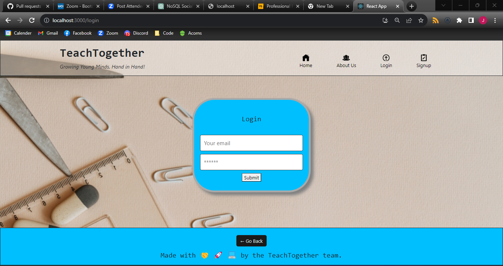

# Teach Together

* ADD BEFORE SUBMITT!!!!
- daniel linked in
- link to heroku
- link to slides
- more features

## Description

We at the Teach Together team sought out to create an app to help solve an issue of communication between teachers and parents. Using our app teachers and parents can communicate back an forth and work together for the success of the students

## Table of Contents

If your README is long, add a table of contents to make it easy for users to find what they need.

- [Teach Together](#teach-together)
  - [Description](#description)
  - [Table of Contents](#table-of-contents)
  - [Usage](#usage)
  - [Creators](#creators)
  - [Credits](#credits)
  - [Features](#features)
      - [Current](#current)
      - [Future](#future)

## Usage

Our app was designed to be simple to use with an easy UI.

To get started the user is presented with the home screen prompting the user to sign up or login in if they are not already. Users can then navigate home page to see and create posts and react to others. 

From the nav bar at the top the can then go to their profile which has a list of all their previous posts.

They can also travel to our about and contact pages to learn more about us and reach out to a developer.

The last option is loggin out.

## Creators

Luke Denhartog
- [LinkedIn](https://www.linkedin.com/in/luke-denhartog-113123261/)
- [GitHub](https://github.com/Afrozez)

Doug Soda
- [LinkedIn](www.linkedin.com/in/douglas-soda-798396133)
- [GitHub](https://github.com/dsoda86)

Daniel Roh
- [LinkedIn](https://www.linkedin.com/in/daniel-roh-37a612123/)
- [GitHub](https://github.com/ryonerd79)

Jake Norris
- [LinkedIn](www.linkedin.com/in/jake-norris-052185b9)
- [GitHub](https://github.com/Searaden)

## Credits

  - The home, about us, sign up, login, and logout icons were all sourced from <https://icons8.com/icons>.
  - The background image for the login/signup page was provided free of charge by olia danilevich! Thanks a bunch!

## Features

#### Current

- Accounts for both parents and teachers
- Ability to read and create posts
- Ability to react to posts
- View profile for all posts made by user

#### Future

- Student accounts
- Link students with their parents and teachers
- Allow parents to contact students teacher directly and view grades
- Teacher to update grades for their students and view all students
- Student to view grades and message teachers
- Direct messaging

Challenges

<https://docs.google.com/presentation/d/1oxahjfxgY_q1jm8Wqvf6V24UfPIWqaZy_eTHdaByvcw/edit#slide=id.p>
